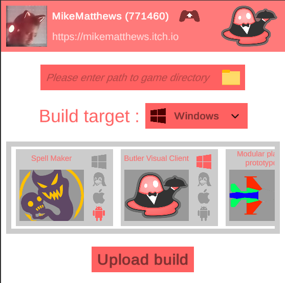

# Butler Visual Client

A visual interface for the butler app provided by itch.io, ideal for beginners.

## Requirements

This tool needs the [butler.exe](https://itchio.itch.io/butler) tool which is provided by itch.io.
This tool needs an itch.io API key linked to your account to operate. You can get it [here](https://itch.io/user/settings/api-keys).

## Usage

On first startup, this tool will ask for :
- An _itch.io_ API key.
- A path to the _butler.exe_ tool on your system.

Once the setup is done, a list of all the projects available on your itch.io accounts will be displayed.\
Each project has a name, cover image and the platforms for which it has a build.

### Support

This tool only supports the following platforms :
- Windows 64
- Linux
- Android
- iOS

### Upload a build

To upload a build to one of your itch.io projects, you can enter the path to a build you want to upload (or use the path picker to select it).

You can then select the target "channel" (platform) in the dropdown and select the itch.io project you want to upload this build to.

Then press the "Upload build" button, which will start the sending process through the _butler.exe_ tool (a command line interface will open with _butler.exe_ for the execution).

## Disclaimer

This software is provided "as is".\
I am not responsible for any damage this software or its misuse could inflict on your system.\
If this tool doesn't work or if you want to use a feature that is not supported, you should visit the [butler.exe docs page](https://itch.io/docs/butler/pushing.html).